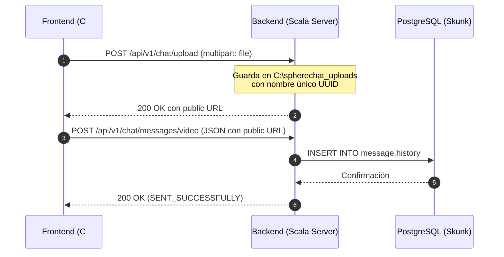

# Guía de Migración para Frontend: Patrón "Upload & Notify"
### 📱 Integración con la API de Chat (Scala backend) desde clientes .NET / C#

---

## 💡 ¿Qué es el Patrón "Upload & Notify"?

Para garantizar la **escalabilidad**, la **persistencia multiusuario** y evitar el uso de rutas locales del sistema de archivos (`/home/...` o `C:\...`) en la base de datos, hemos migrado los endpoints de chat a una arquitectura desacoplada en dos pasos obligatorios:

1. **Carga (Upload):** El cliente físico sube el archivo binario (imagen, video, audio o documento) al servidor a través de una petición multipart. El servidor almacena el archivo en una ruta centralizada (`C:\spherechat_uploads`) y devuelve una **URL pública única**.
2. **Notificación (Notify):** El cliente envía un mensaje al endpoint multimedia correspondiente enviando **únicamente la URL pública** devuelta, junto con los metadatos necesarios.

Esto permite que cualquier usuario en cualquier dispositivo pueda descargar o reproducir en streaming los archivos multimedia de forma transparente.

---

## ⚡ Soporte para Streaming Multimedia (Partial Content 206)

El servidor de archivos estáticos bajo `/uploads/*` tiene habilitado el soporte nativo para **HTTP Range Requests** (Partial Content). 
* Cuando el reproductor de video/audio del frontend C# intente reproducir un archivo pesado, enviará el header `Range: bytes=start-end`.
* El servidor responderá con un código **`206 Partial Content`** enviando únicamente los bytes solicitados.
* **Beneficio:** Esto permite que tus controles multimedia en el Frontend carguen de forma instantánea, soporten búsquedas rápidas (seeking) y consuman un ancho de banda mínimo.

---

## 🔒 Seguridad e Identidad

Todos los endpoints (con excepción del streaming estático) requieren autenticación **JWT Bearer Token** en el header:
```http
Authorization: Bearer <tu_token_jwt>
```
> [!IMPORTANT]
> **Sin `senderId` en los payloads:** El backend extrae el identificador del usuario emisor directamente de la firma criptográfica del JWT de manera 100% segura. **No debes enviar** el campo `senderId` en los requests JSON.

---

## 🔄 El Flujo de Trabajo en Dos Pasos (Ejemplo: Envío de Video)



---

## 📑 Especificación de Endpoints y Contratos

### 📦 1. Paso 1: Carga de Archivo (Upload)

* **Endpoint:** `POST /api/v1/chat/upload`
* **Content-Type:** `multipart/form-data`
* **Headers:** `Authorization: Bearer <token>`
* **Cuerpo (Form-Data):**
  * `file`: Archivo binario (Imagen, Video, Audio, Documento)

#### 🟢 Respuesta Exitosa (200 OK):
```json
{
  "url": "http://localhost:8082/uploads/550e8400-e29b-41d4-a716-446655440000_mi_video.mp4",
  "fileName": "mi_video",
  "extension": "mp4",
  "sizeBytes": 15482910
}
```

* **Extensiones Soportadas:** 
  * *Imágenes:* `jpg`, `jpeg`, `png`, `gif`, `webp`, `bmp`, `svg`
  * *Videos:* `mp4`, `mov`, `avi`, `mkv`, `webm`
  * *Audios:* `mp3`, `ogg`, `wav`, `aac`, `m4a`, `opus`
  * *Documentos:* `pdf`, `doc`, `docx`, `xls`, `xlsx`, `ppt`, `pptx`, `txt`, `csv`, `zip`, `rar`

---

### 📨 2. Paso 2: Notificar Mensaje Multimedia (Notify)

Una vez que tengas la URL devuelta por el paso de Carga, debes llamar al endpoint correspondiente al tipo de archivo.

#### 🎥 A. Notificar Video
* **Endpoint:** `POST /api/v1/chat/messages/video`
* **Request JSON:**
```json
{
  "roomId": 1,
  "url": "http://localhost:8082/uploads/550e8400-e29b-41d4-a716-446655440000_mi_video.mp4",
  "durationSeconds": 120.5,
  "sizeBytes": 15482910,
  "thumb": "http://localhost:8082/uploads/thumb_default.jpg"
}
```

#### 🖼️ B. Notificar Imagen
* **Endpoint:** `POST /api/v1/chat/messages/image`
* **Request JSON:**
```json
{
  "roomId": 1,
  "url": "http://localhost:8082/uploads/8c7f92b4-3b2a-412d-bc4d-112233445566_foto.png",
  "width": 1920,
  "height": 1080,
  "caption": "Foto del despliegue en producción"
}
```

#### 🎵 C. Notificar Audio / Nota de Voz
* **Endpoint:** `POST /api/v1/chat/messages/audio`
* **Request JSON:**
```json
{
  "roomId": 1,
  "url": "http://localhost:8082/uploads/443f11e9-4a92-48df-aa22-55bb66cc77dd_audio.opus",
  "durationSeconds": 15.3,
  "waveform": "0.1,0.5,0.8,0.3,0.9,0.2"
}
```

#### 📄 D. Notificar Documento (PDF, Word, Excel, etc.)
* **Endpoint:** `POST /api/v1/chat/messages/document`
* **Request JSON:**
```json
{
  "roomId": 1,
  "url": "http://localhost:8082/uploads/d3b07384-d113-4956-a5db-2bb1b59cc3c4_informe.pdf",
  "fileName": "informe_mensual",
  "extension": "pdf",
  "sizeBytes": 2048576
}
```

#### 🟢 Respuesta Común de Envío (200 OK):
```json
{
  "messageId": 2341,
  "status": "SENT_SUCCESSFULLY"
}
```

---

### 📜 3. Recuperar Historial con Multimedia

Cuando el usuario inicia sesión o recarga una sala de chat, el Frontend debe consultar este endpoint para pintar el historial completo y resolver las URLs de streaming.

* **Endpoint:** `GET /api/v1/chat/rooms/{roomId}/messages`
* **Query Params (Opcionales):** `limit` (por defecto 50), `offset` (por defecto 0)

#### 🟢 Respuesta Exitosa (200 OK):
```json
[
  {
    "id": 2341,
    "roomId": 1,
    "senderId": 7,
    "messageType": "VIDEO",
    "text": null,
    "url": "http://localhost:8082/uploads/550e8400-e29b-41d4-a716-446655440000_mi_video.mp4",
    "durationSeconds": 120.5,
    "sizeBytes": 15482910,
    "caption": null,
    "thumb": "http://localhost:8082/uploads/thumb_default.jpg",
    "waveform": null,
    "stickerId": null,
    "fileName": null,
    "fileExtension": null,
    "createdAt": "2026-05-26T12:00:00Z",
    "isRead": false
  },
  {
    "id": 2340,
    "roomId": 1,
    "senderId": 3,
    "messageType": "TEXT",
    "text": "Hola, por favor revisa el video de la demo técnica que te envié arriba.",
    "url": null,
    "durationSeconds": null,
    "sizeBytes": null,
    "caption": null,
    "thumb": null,
    "waveform": null,
    "stickerId": null,
    "fileName": null,
    "fileExtension": null,
    "createdAt": "2026-05-26T11:59:00Z",
    "isRead": true
  }
]
```

---

## 🛠️ Ejemplo de Implementación en C# (HttpClient)

Aquí tienes una implementación limpia de referencia para el cliente Frontend C# utilizando `HttpClient`:

```csharp
using System;
using System.IO;
using System.Net.Http;
using System.Net.Http.Headers;
using System.Text;
using System.Text.Json;
using System.Threading.Tasks;

public class SphereChatClient
{
    private readonly HttpClient _httpClient;
    private const string BaseUrl = "http://localhost:8082";

    public SphereChatClient(string jwtToken)
    {
        _httpClient = new HttpClient();
        _httpClient.DefaultRequestHeaders.Authorization = new AuthenticationHeaderValue("Bearer", jwtToken);
    }

    // Paso 1: Subir Archivo Físico
    public async Task<UploadResult> UploadFileAsync(string localPath)
    {
        var fileInfo = new FileInfo(localPath);
        if (!fileInfo.Exists) throw new FileNotFoundException("El archivo local no existe.");

        using var form = new MultipartFormDataContent();
        using var fileStream = new FileStream(localPath, FileMode.Open, FileAccess.Read);
        using var streamContent = new StreamContent(fileStream);
        
        // Mime Type automático
        streamContent.Headers.ContentType = new MediaTypeHeaderValue("application/octet-stream");
        form.Add(streamContent, "file", fileInfo.Name);

        var response = await _httpClient.PostAsync($"{BaseUrl}/api/v1/chat/upload", form);
        response.EnsureSuccessStatusCode();

        var json = await response.Content.ReadAsStringAsync();
        return JsonSerializer.Deserialize<UploadResult>(json, new JsonSerializerOptions { PropertyNameCaseInsensitive = true });
    }

    // Paso 2: Notificar Envío de Video al Servidor
    public async Task<bool> SendVideoMessageAsync(long roomId, UploadResult uploadResult, double duration)
    {
        var payload = new
        {
            RoomId = roomId,
            Url = uploadResult.Url,
            DurationSeconds = duration,
            SizeBytes = uploadResult.SizeBytes
        };

        var content = new StringContent(JsonSerializer.Serialize(payload), Encoding.UTF8, "application/json");
        var response = await _httpClient.PostAsync($"{BaseUrl}/api/v1/chat/messages/video", content);
        
        return response.IsSuccessStatusCode;
    }
}

public class UploadResult
{
    public string Url { get; set; }
    public string FileName { get; set; }
    public string Extension { get; set; }
    public long SizeBytes { get; set; }
}
```
